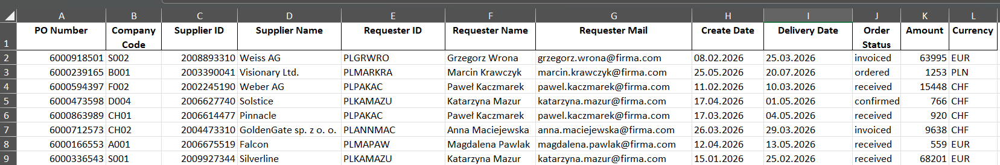
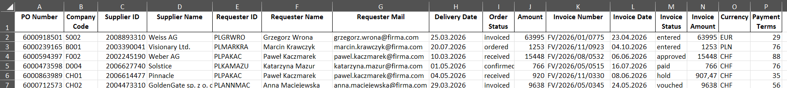
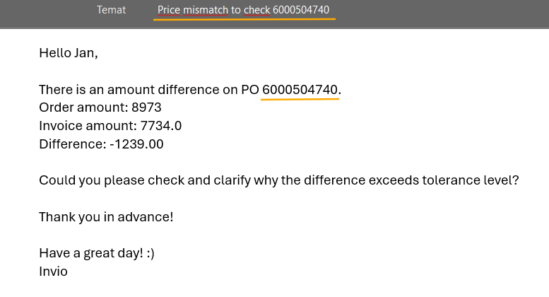
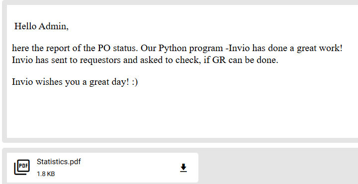

# Invio

------------------------------------ENGLISH VERSION-------------------------------------------------------------

Invio
⚙️ Program “Invio” — Automation of the Price Mismatch process in the AP department

Author: Kamila Dudzińska

Area: Procurement / Accounts Payable (AP)

Technologies: Python, Pandas, Outlook, Excel

Modules: pandas, win32com, datetime, reportlab, random

Source: procurement_mock_dataset_invio.xlsx — created based on my own script “dataset_mock_invio.py”

🎯 Project Goal

The Invio program automates the analysis of procurement data and the sending of emails regarding net amount differences (Price Mismatch) between a Purchase Order (PO) and an invoice in the CORA/Ariba system. The tool eliminates the need for manually checking hundreds of entries and sending follow‑ups to buyers, which saves a significant number of FTEs and speeds up the discrepancy resolution process.

💱 How the program works:

The program analyzes the purchase order table and the invoice table, comparing statuses and net values.

The program iterates row by row through the purchase order table and compares the data with the invoice report.
If it finds a Purchase Order (PO) with the status “received” in the Ariba report and with the status “hold” in the Invoice table, it additionally checks the net amounts.
If the net amount difference is greater than 20 EUR or 5% of the PO value, the program sends an email to the buyer requesting clarification of the differences.
After completing the task, the program informs the administrator how many emails were sent — in the active IDE console — and additionally sends a PDF report with statistics to the administrator’s email.

🚀 Project Advantages:

--> addresses a real problem in many operational processes where checking and repetitive sending of reminders/follow‑ups is required

--> reduces issues with explaining price mismatch (net amount differences) and helps decrease invoice overdue cases, minimizing the risk of supplier issues or reputational damage

--> the program administrator receives statistics, making it easier to control the Price Mismatch process

--> the program automates work within the procurement/AP department

--> the program is written for a typical corporate environment with a logged‑in Outlook

--> the program is dedicated to SAP, but can be quickly adapted to other systems — simply analyze the reports generated by any other platform.

🗂️ Project Structure

--> invio_g.py — main program automating analysis and email sending

--> dataset_mock_invio.py — test data generator

--> procurement_mock_functions.py — module supporting data logic

📦 How to run?

In the cataloque:

pip install pandas reportlab pywin32

Sample code fragments and screenshots of emails and reports.

Charts with purchase orders:

Chart with invioices:

Code:

Email to buyer:

Email to administrator:

### 📧 Kontakt

Kamila Dudzińska

📧 kamila.dudzinska@onet.pl 

------------------------------------POLISH VERSION-------------------------------------------------------------

⚙️ Program „Invio” — Automatyzacja procesu Price Mismatch w dziale AP

Autor: Kamila Dudzińska

Obszar: Procurement / Accounts Payable (AP)

Technologie: Python, Pandas, Outlook, Excel

Moduły: pandas, win32com, datetime, reportlab, random# Invio

Źródło: procurement_mock_dataset_invio.xlsx - stworzony na podstawie własnego skryptu "dataset_mock_invio.py"

📁 Jak uruchomić?

Sklonuj repozytorium.
Zainstaluj moduły pip install -r requirements.txt
Uruchom skrypt

🎯 Cel projektu

Program Invio automatyzuje analizę danych zakupowych oraz wysyłkę maili dotyczących różnic kwot netto (Price Mismatch) pomiędzy zamówieniem (PO) a fakturą w systemie CORA/Ariba.
Narzędzie eliminuje konieczność ręcznego sprawdzania setek pozycji i wysyłania follow‑upów do kupców, co pozwala zaoszczędzić znaczną liczbę FTE oraz przyspiesza proces wyjaśniania niezgodności.

💱 Jak działa program: 

Program analizuje tabelę zamówień oraz tabelę faktur, porównując statusy i wartości netto.
1. Program iteruje wiersz po wierszu w tabeli za zamówieniami i porównuje dane z raportem z tabeli z fakturami. 
2. Jeśli znajdzie zamówienie (PO) ze statusem "received" ("otrzymane") w raporcie "Ariba" oraz ze statusem"hold" w tabeli "Faktury" to sprawdzi dodatkowo kwoty netto.
3. Jeżeli różnica kwot netto będzie większa niż 20 EUR lub 5% wartości zamówienia to program wyśle maila do kupca z prośbą o wyjaśnienie różnic. 
4. Po wykonaniu zadania program poinformuje administratora, ile maili zostało wysłanych - w przypadku aktywnej konsoli IDE oraz dodatkowo wyśle raport ze statystykami w formacie pdf na maila administratora.
   

🚀 Zalety projektu:

--> odpowiada na realny problem w wielu procesach operacyjnych, gdzie wymagane jest sprawdzanie i repetetywne wysyłanie przypominajek/follow-upów

--> zmniejsza problem z wyjaśnianiem price missmatch (różnic cenowych) i przyczynia się do redukcji zaległych faktur (invoice overdue) i zminimalizować ryzyko kłopotów z dostawcami, czy utraty wizerunku

--> administrator programu otrzymuje statystyki, dzięki czemu łatwiej kontrolować proces Price Missmatch

--> program automatyzuje pracę w obrębie działu zakupów/AP

--> program napisany pod typowe środowisko korporacyjne z zalogowanym "Outlookiem"

--> program dedykowany SAP, ale można go szybko dopasować do innych systemów - wystarczy przeanalizować raporty generowane przez dowolny inny program.

🗂️ Struktura projektu

-->invio_g.py — główny program automatyzujący analizę i wysyłkę maili

-->dataset_mock_invio.py — generator danych do testów

-->procurement_mock_functions.py — moduł wspierający logikę danych

⚙️ Instalacja i uruchomienie

🔧 Wymagania

Python 3.10+

Zainstalowany Outlook (dla wysyłki maili) oraz opcjonalnie Excel do odczytu csv

Biblioteki: pandas, reportlab, win32com, os, datetime

📦 Instalacja

W katalogu projektu uruchom:

pip install pandas reportlab pywin32

Przykładowe fragmenty kodu oraz screen z maila i raportów.

Tabela z zamówieniami:

Tabela z fakturami:

Fragmenty kodu:

Email do buyera:

Email dla administratora:

### 📧 Kontakt --> Kamila Dudzińska

📧 kamila.dudzinska@onet.pl  

🌐 [LinkedIn](https://www.linkedin.com/flagship-web/in/kamila-dudzi%C5%84ska-856bb31b8/)

